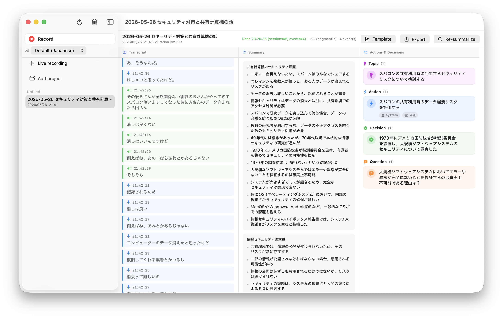

# LocalGijiroku

English | [日本語](./README.ja.md)



A local-first meeting recorder for macOS. Records your audio, transcribes it with WhisperKit on-device, and produces rolling LLM summaries plus extracted decisions, actions, and questions — all without a single byte leaving the machine.

## What it does

- Captures **microphone audio** and **system audio** simultaneously (so the other side of Zoom / Meet calls is included).
- Streams audio through **WhisperKit** for real-time, multilingual transcription (Japanese and English tuned). The live transcript shows confirmed text alongside an italicized, dimmed "unconfirmed tail" so you can see the rolling Whisper output the moment it lands; confirmed segments are what get saved and shown to the LLM.
- Every 30 seconds, hands new confirmed transcript to a **local LLM** (MLX or Ollama) for:
  - an append-only **summary** update (LLM only sees existing section titles + new transcript and emits just the new bullets), followed by a consolidation pass that folds semantic duplicates — keeps per-turn cost roughly constant for hour-long meetings.
  - extraction of structured **events** (topics / questions / decisions / action items, with owner + due date when stated), including resolution detection against open items.
- On Stop, a full-pass **regenerate** rewrites the saved summary from the entire transcript in one shot, so the saved artifact is polished even though the live deltas were cheap.
- Crash-safe **autosave** writes the in-progress recording to a `Drafts/` directory every 30 seconds and after each LLM turn. If the app crashes / is force-quit / loses power, the next launch automatically promotes the orphan back into Sessions with a `[復元]` / `[Recovered]` title prefix.
- Optional **speaker diarization** via Pyannote (SpeakerKit), with cross-window label persistence by time-overlap clustering.
- Sessions are organized into **projects**, stored on disk as plain JSON, exportable as Markdown via a customizable template.
- Per-session, per-project, and user-level **summary style templates** (bullet word limits, section caps, extra instructions for the LLM).
- **Guided onboarding** that walks through permissions (mic / screen recording / notifications), LLM backend choice, and audio setup.
- Background **model downloader** with progress + macOS notification on completion, so the first Start isn't blocked on a multi-GB pull.
- Built-in **log viewer** (Cmd-Shift-L) for inspecting capture / transcription / LLM activity without leaving the app.
- **UI language switcher** (Japanese / English / Follow System) in Settings → General, applied live.

## Privacy

Audio, transcripts, summaries, and extracted events stay on this Mac. No network calls except the initial model download (HuggingFace for MLX / WhisperKit / SpeakerKit). You can verify by inspecting `~/Library/Application Support/GijirokuTaker/` (the on-disk folder still uses the original SwiftPM target name) or by watching network activity while recording.

## Requirements

- macOS 15 (Sequoia) or later — tested on macOS 26 Tahoe.
- Apple Silicon Mac (MLX is Apple Silicon-only).
- Xcode 26 with the **Metal Toolchain** component:

  ```bash
  xcodebuild -downloadComponent MetalToolchain
  ```

- Optional: [Ollama](https://ollama.com) if you prefer Ollama over the bundled MLX backend.

## Build & run

```bash
# 1. One-time: install the Metal Toolchain (see above).
# 2. Build the .app bundle (xcodebuild is required so MLX's Metal shaders
#    compile into default.metallib).
bash scripts/bundle.sh           # debug
bash scripts/bundle.sh release   # release

# 3. Launch.
open build/LocalGijiroku.app
```

The first time you press **Record**, macOS will ask for the **Microphone** and **Screen Recording** permissions. Screen Recording is used by ScreenCaptureKit only to capture system audio — no video is written.

The first time you select an MLX model, ~2–5 GB will download from HuggingFace into `~/.cache/huggingface/hub/`.

## Backends

| Backend | Setup | Notes |
| --- | --- | --- |
| **MLX** (default) | None — the model auto-downloads on first use. | Runs fully in-process. Curated `mlx-community/` models from Qwen3 1.7B up to Qwen2.5 14B. |
| **Ollama** | `brew install ollama && ollama pull qwen2.5:7b` | Useful if you already have Ollama running. The Settings → LLM tab lists whatever `ollama list` returns. |

## Tests

```bash
swift test                                       # ~105 hermetic unit tests
RUN_OLLAMA_TESTS=1 swift test --filter ollama    # live Ollama integration
.build/debug/GijirokuCLI /path/to/audio.wav      # headless E2E from a WAV
```

## Architecture (one paragraph)

A SwiftPM workspace with four targets — `GijirokuCore` (audio types, persistence, LLM client protocol, summary/event engines), `GijirokuLLM` (MLX integration, model catalog), `GijirokuTaker` (the SwiftUI app target — UI, audio capture via ScreenCaptureKit + AVAudioEngine, WhisperKit transcription, SpeakerKit diarization), and `GijirokuCLI` (headless E2E runner). `CLAUDE.md` has the full design notes and known constraints.

## License

[MIT](./LICENSE) — see file for terms.
